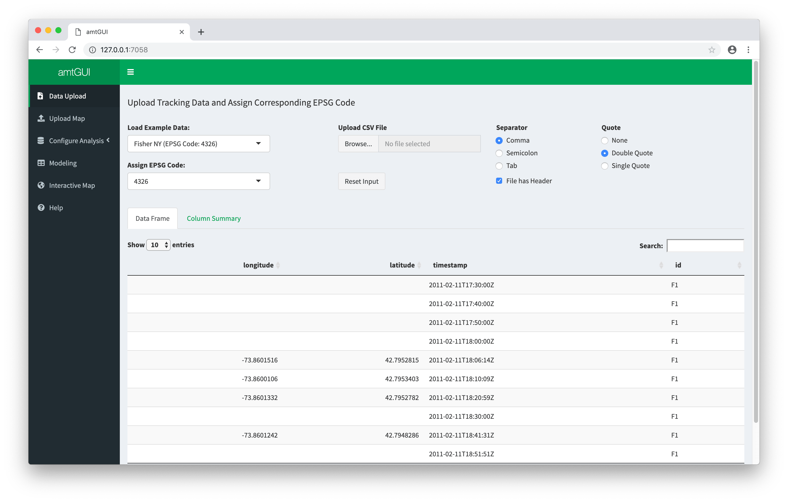
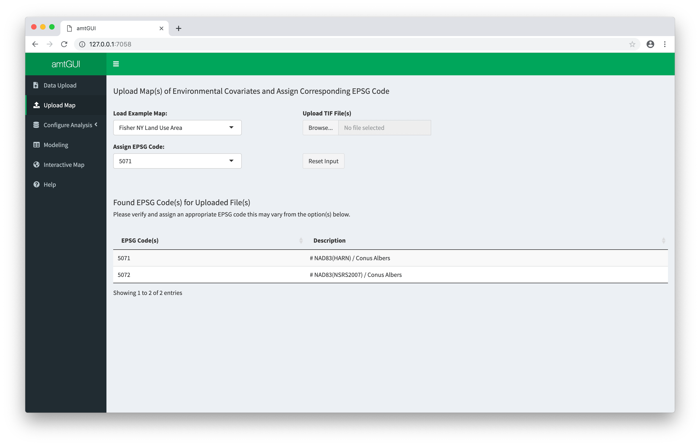
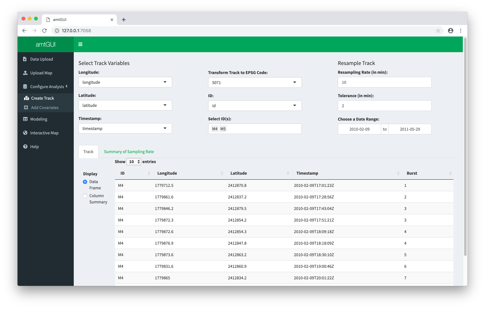
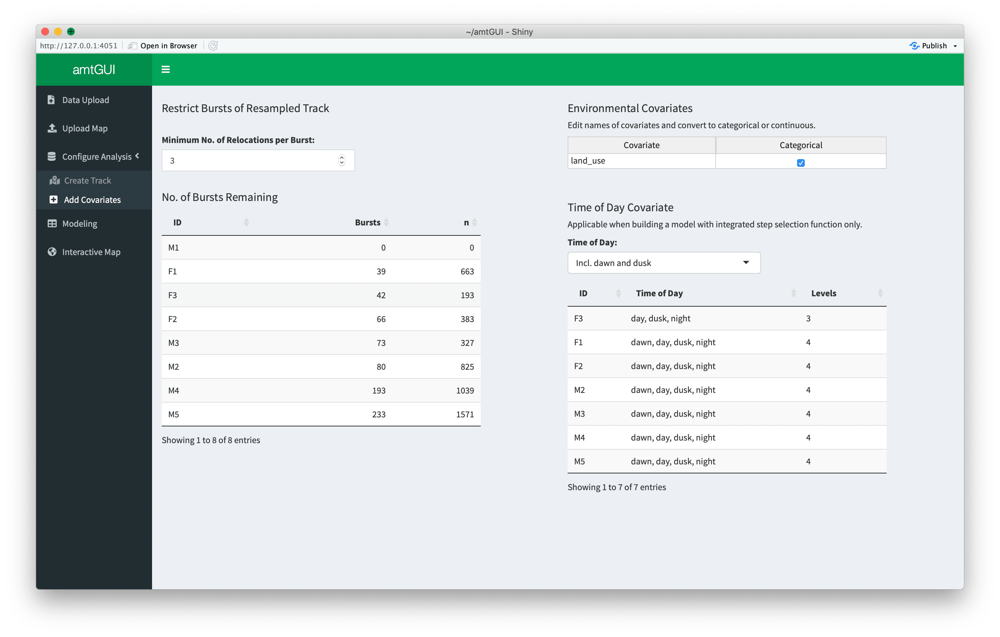
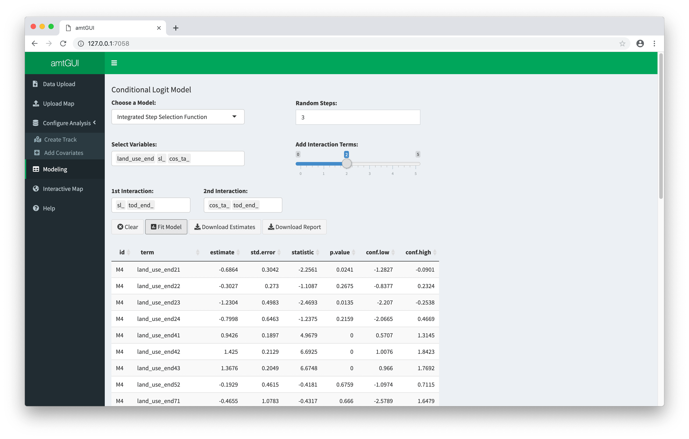
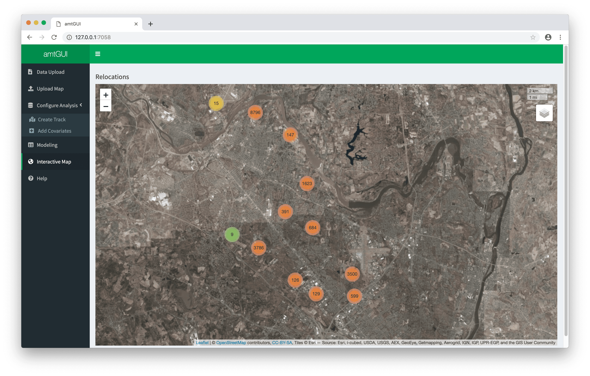

<!-- README.md is generated from README.Rmd. Please edit that file -->
amtGUI
======

The goal of `amtGUI` is to provide a simple user interface to `amt` with Shiny for the analysis of animal telemetry data. This `README` shows how to use the app. For a detailed explanation of how the app and it's underlying calculations work consider reading the term paper.

Running `amtGUI`
----------------

You can run `amtGUI` from github with:

``` r
# install.packages("shiny")
# install.packages("shinydashboard")
# install.packages("shinyjs")
# install.packages("amt")
# install.packages("rhandsontable")
# install.packages("leaflet")
# install.packages("tidyverse")
runGitHub( "amtGUI", "abuchmueller") 
```

Getting started
---------------

To get started you will need two things: A dataset containing GPS data of at least one animal and a map containing environmental covariates for land use or sea level (usually in form of a .tif image) for the underlying area of study.

However, `amtGUI` comes with examples for both so you can get started immediately.

Uploading data
--------------

We proceed to load the "Fisher NY" data set, a reduced version of fisher data from LaPoint et al. (2013a).



After loading your data successfully, you can see it below. You can switch between your data and a column summary of it. **Note:** You need to assign a valid EPSG code in order to proceed here. The code for our showcase data set is 4326.

Uploading a map
---------------

After you've loaded your data set you may proceed to load your landuse raster (map).



`amtGUI` tries to automatically detect all known EPSG codes of the raster and will give suggestions, however, you still need to assign one manually to proceed.

After this is done you can start configuring your analysis.

Configuring your analysis
-------------------------

This section of the App is split in two tabs. Inside the first tab you can create tracks. In the second tab you can add additional covariates to your analysis.

For now let's begin with the track creation. To create a track, you need to specifiy which columns of your data set contain the x and y-coordinates (longitude and latitude, respectively) as well as the timestamps. This is mandatory, as without a track, you can't perform meaningful analysis of telemetry data. Additionally, you can specify an ID column for your data to identify which observations belong to which animal, or if you have multiple animals in your data set and specify ID you can filter animals out or perform analysis on a single animal. Another example could be a column you may add to your CSV file beforehand and assign it as ID say "summer" that consists of a dummy variable indicating if it's summer or winter. To create the track now you only need to specify two more things: The resampling rate and the tolerance both in minutes for your track then you're done. The app will immediately start working in the background to (re)calculate your track(s). You can also set a date range, the default setting is to set to the date range of your data so you don't need to specify one to proceed. If you omit an ID value the date range will be refreshed accordingly.

 The "Add Covariates" tab let's you configure your analysis further. On the left side of the tab the minimum number of relocations per burst (bursts are subsets of the track with constant sampling rate, within the specified tolerance). The default here is 3, as you would need 3 relocations within one time interval to calculate the turning angle of a step (relevant for iSSF). This will be accompanied by a small table giving you information on the number of bursts remaining for each animal ID with your current settings.

On the right side you can edit the names of environmental covariates and transform them into categorical variables with a simple checkbox. You can also set to include or exclude the time of day as a categorical covariate. This will be accompanied by a table where you can see existing levels for each animal ID.



Model Building
--------------

If you correctly set up your track before, you are now ready to fit statistical models with `amtGUI`.

On the Modeling tab you can choose between two model types: Integrated Step Selection Functions (iSSF) and Resource Selection Functions (RSF).

To fit an iSSF you need to select the input variables you want to use. Besides your covariates you can specify up to 5 interaction terms. By moving the slider you can increase/decrease the number of interaction terms. Addtionally you can specify the number of random steps for each taken step (iSSF only) or the number of random points in case of the RSF. Hitting the "Fit Model" button will immediately start the fitting process (as indicated by the progress bar). Below the buttons you can see your model estimates which you can download in a csv file. Clicking the "Clear" button resets the tab so you can begin fresh. This is recommended before fitting a new model.



If you want to save your analysis to recreate it later you can download a report file by clicking the "Download report" button which will create a report containing all entered user inputs.

Interactive Map
---------------

Here you can take visualize your data set for one animal at a time or the whole data set. If you supplied the app with ID's in the "Create Track" tab and only choose ***one*** active ID ***or no*** ID at all, you can see an interactive map here.


